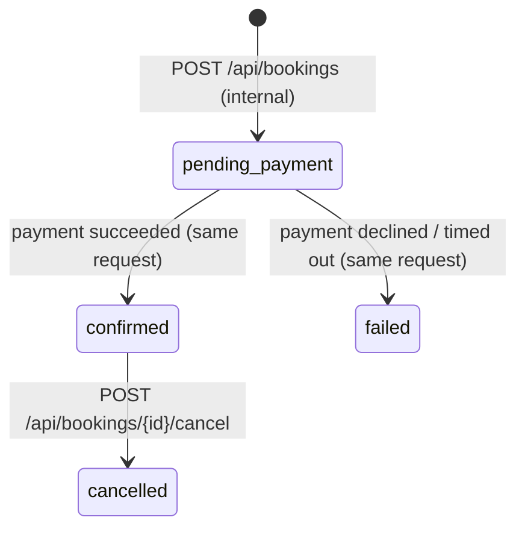

# API integration guide

For integrators building their own frontend or backend on SlotBook. The machine-readable
contract is [openapi.yaml](openapi.yaml) (OpenAPI 3.1; load it into Swagger UI, Redocly or
a client generator).

## Model

```text
Service ──< Slot ──< Booking
(what)      (when)    (who, state, payment reference)
```

- **Service**: something bookable with a duration and a price in integer minor units.
- **Slot**: one start/end time for one service. Either `open` or taken.
- **Booking**: a customer's claim on one slot. Has a state machine (below).

There are no provider/staff, location, or customer entities in the service. A booking
stores the customer's name and email as given by the caller. Services and slots are
created by the seed script or directly in the database; **there is no API for managing the
catalog yet**.

## Authentication

Every endpoint except `GET /api/health` requires an API key from the server's `API_KEYS`:

```http
Authorization: Bearer <api-key>
```

or `X-API-Key: <api-key>`. A missing/wrong key returns `401 UNAUTHORIZED`.

The contract is **service-to-service**: SlotBook trusts the calling application to have
authenticated its own user and to pass that user's name and email. SlotBook has no user
accounts, sessions or per-user permissions, so any holder of an API key can read and cancel
any booking. Keep keys on your server; do not ship them to browsers (the demo client does,
for demonstration only).

Operator endpoints under `/api/admin/*` use a separate `X-Admin-Key` and are disabled
(404) unless the server sets `ADMIN_API_KEY`.

## Request conventions

- JSON bodies (`content-type: application/json`), max 100 KB.
- IDs are UUIDs. A malformed ID in a path returns 404; in a body, 400.
- Timestamps are ISO-8601 UTC. The slots `date` query parameter is a UTC day.
- Money is `amountCents` + `currency`; never floating point.
- Send `X-Request-Id` and/or `X-Correlation-Id` to have them echoed back and included in
  server and worker logs. Otherwise the server generates them. Quote `correlationId` from
  error responses when reporting problems.
- **Pagination: none.** List endpoints return everything (one day of slots; all bookings
  for an email).

## Errors

```json
{ "error": { "code": "SLOT_UNAVAILABLE", "message": "Selected slot is no longer available",
             "correlationId": "…", "retryable": false } }
```

| HTTP | `code` | Meaning / what to do |
|---|---|---|
| 400 | `VALIDATION_ERROR` | Fix the request. |
| 401 | `UNAUTHORIZED` | Missing/invalid API key (or admin key). |
| 402 | `PAYMENT_FAILED` | Declined. Booking is `failed`, slot released. New key to try again. |
| 404 | `NOT_FOUND` | Unknown resource or route. |
| 409 | `SLOT_UNAVAILABLE` | Slot taken. Refresh slots and pick another. |
| 409 | `CONFLICT` | Idempotency key in progress, previously failed, or reused with a different body (`details.code: IDEMPOTENCY_CONFLICT`). |
| 409 | `INVALID_STATE_TRANSITION` | Operation not allowed from the booking's current state; `details` lists `from` and `allowedFrom`. |
| 429 | `RATE_LIMITED` | Per client IP. See `X-RateLimit-*` headers. |
| 500 | `INTERNAL_ERROR` | Unexpected. Includes payment timeouts and open payment circuit. The booking may exist — check before retrying. |
| 503 | `SERVICE_UNAVAILABLE` | A dependency is down. For `POST /api/bookings`, this can happen after the booking was confirmed — check before retrying. |

## Booking lifecycle



Clients never set a status. `pending_payment` only exists while the create request is
running (or if the server crashed mid-request — see
[known limitations](../architecture/known-limitations.md)). A successful create returns a
`confirmed` booking.

| Operation | Allowed from | Result | Otherwise |
|---|---|---|---|
| `POST /api/bookings` | — | `confirmed` (201) | `failed` + 402/500, or 409 before any booking exists |
| `POST /api/bookings/{id}/cancel` | `confirmed` | `cancelled`, slot reopened | `cancelled` → 200 `changed:false`; `pending_payment`/`failed` → 409 `INVALID_STATE_TRANSITION` |

Not available: rescheduling, confirmation as a separate step, provider assignment,
arrival/in-progress/completed tracking, expiry of unpaid bookings, refunds. See
[booking-lifecycle.md](../architecture/booking-lifecycle.md).

## Creating a booking safely

```bash
curl -X POST http://localhost:8080/api/bookings \
  -H "Authorization: Bearer $API_KEY" \
  -H "Idempotency-Key: 6f1c3c1e-8a55-4c55-9a0c-3b7d8a1f2e90" \
  -H 'content-type: application/json' \
  -d '{"serviceId":"…","slotId":"…","customerName":"Ada","customerEmail":"ada@example.com"}'
```

Generate one `Idempotency-Key` per *booking intent* (e.g. per checkout attempt), and keep
it until you have a definitive answer.

| You got | Do |
|---|---|
| 201 / 200 `replayed:true` | Done. |
| Timeout / connection error | Retry with the **same** key. 409 `CONFLICT` means it's still running — back off and retry; eventually you get 200 `replayed:true`. |
| 402, 409 `SLOT_UNAVAILABLE`, 400 | Final for this key. Fix input / pick another slot, then use a **new** key. |
| 500 / 503 | Look up `GET /api/bookings?email=…` for a new booking on that slot. If none, retry with a **new** key (the old key stays blocked for 24h). |

Keys are global across all API keys and live 24h by default, so use UUIDs.

## Cancelling

```bash
curl -X POST -H "Authorization: Bearer $API_KEY" http://localhost:8080/api/bookings/$ID/cancel
```

Safe to retry; no idempotency key needed. It doesn't refund: use `paymentReference`
with your payment provider. It also doesn't emit an event.

## Events

After a booking is confirmed, SlotBook publishes `booking.created` to the RabbitMQ topic
exchange `booking.events`. The bundled worker consumes it to send a (logged) confirmation.
Other applications can bind their own queue to `booking.events` with routing key
`booking.created`:

```json
{
  "type": "booking.created",
  "bookingId": "uuid", "serviceId": "uuid", "slotId": "uuid",
  "customerEmail": "ada@example.com", "customerName": "Ada",
  "amountCents": 4500, "currency": "USD",
  "occurredAt": "2026-09-28T08:00:00.000Z", "correlationId": "…"
}
```

Delivery is at-least-once to consumers, but publication itself is **not guaranteed** (no
outbox, no publisher confirms): treat events as notifications, and the HTTP API as the
source of truth. There is no `booking.cancelled` event.

## Minimal integration flow

```text
GET  /api/services                          → show catalog
GET  /api/services/{id}/slots?date=…        → show availability
POST /api/bookings  (Idempotency-Key)       → 201 confirmed | 409 pick another slot
GET  /api/bookings/{id}                     → booking page
POST /api/bookings/{id}/cancel              → cancel
```
