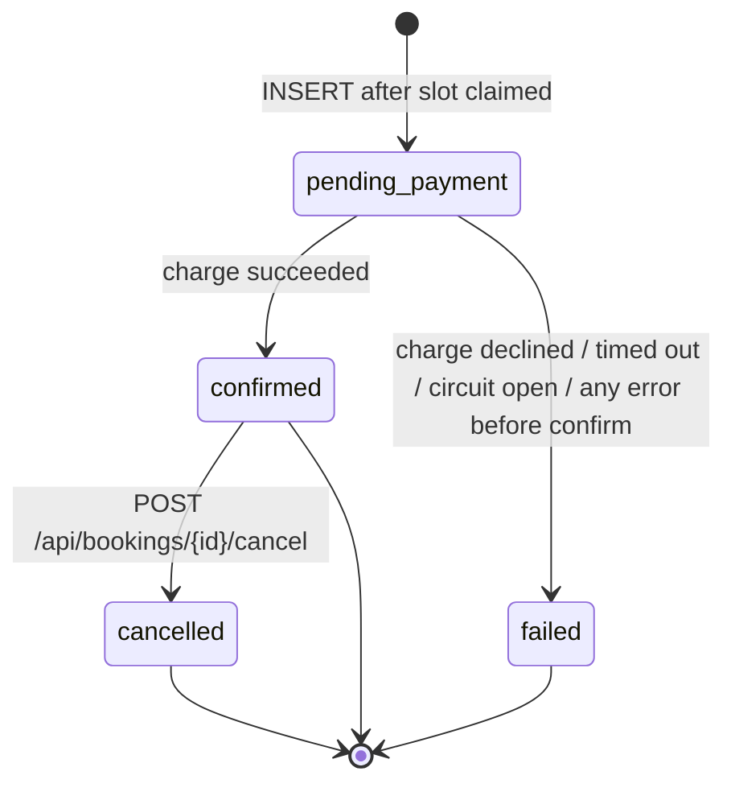
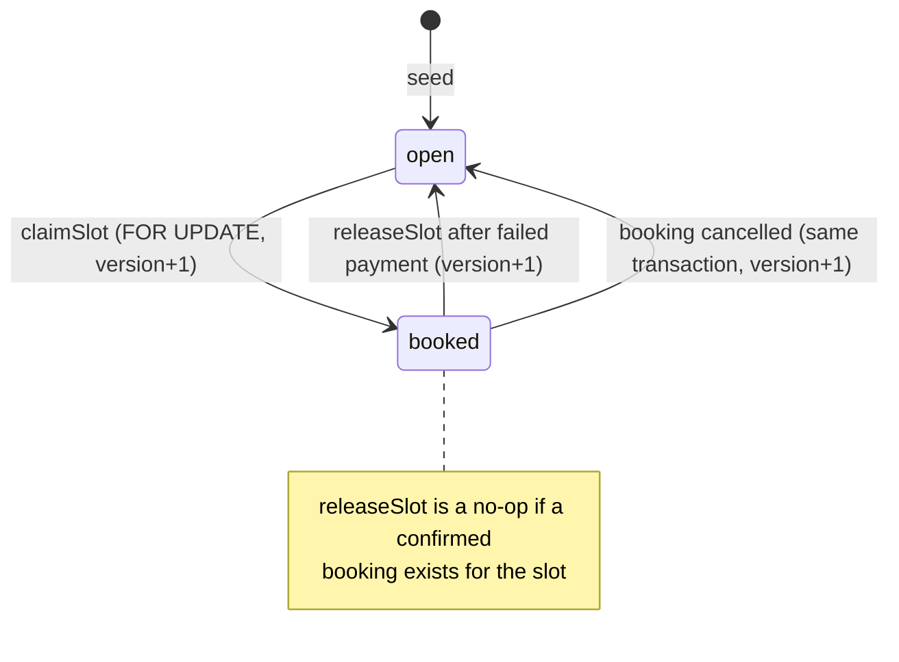

# Booking lifecycle

SlotBook books **time slots for a service** (haircut, massage, consultation). There are
no technicians/providers, dispatch, arrival, in-progress or completed states in this
codebase, and none were added: they would be new product features, not a refactor.
Domain assumption: a booking is a reservation of one slot for one customer, paid up front. Two state
machines matter: the **booking** and the **time slot** it reserves.

Sources: `domain/entities/Booking.ts`, `domain/entities/ServiceOffering.ts`,
`application/use-cases/CreateBookingUseCase.ts`, `infrastructure/repositories/PostgresServiceRepository.ts`,
and the `CHECK` constraints in `migrations/001_init.sql`.

## Booking states



| State | Meaning | Entered from | Written by |
|---|---|---|---|
| `pending_payment` | Slot is claimed, booking row exists, charge not yet settled | — (initial) | `PostgresBookingRepository.save` |
| `confirmed` | Payment reference recorded; slot permanently booked | `pending_payment` | `Booking.confirm` + `update` |
| `failed` | Payment did not succeed (or an error happened before confirm); slot released | `pending_payment` | `Booking.markFailed` + `update` |
| `cancelled` | Customer/operator cancelled; slot reopened in the same transaction | `confirmed` (via API) | `PostgresBookingRepository.cancel` (`Booking.cancel` + conditional `UPDATE`) |

Guards enforced by the entity:

- `confirm()` only from `pending_payment`.
- `markFailed()` from anything except `confirmed` (so `failed → failed` and
  `cancelled → failed` are technically allowed by the entity, but no code path does it).
- `cancel()` only from `confirmed` or `pending_payment`. The API narrows this to
  `confirmed`: a `pending_payment` booking belongs to a create request that is still
  running (or crashed), and cancelling it would race with that request's confirm/fail
  write. Such requests get `409 INVALID_STATE_TRANSITION`.

Guards enforced by the database:

- `status IN ('pending_payment','confirmed','cancelled','failed')`.
- `bookings_confirmed_slot_uq`: at most one `confirmed` booking per `slot_id`.
- `bookings_idempotency_uq`: at most one booking per `idempotency_key`, **in any status**.

The entity guards run in process on an object loaded (or created) in the same request.
The cancel path re-checks in SQL (`WHERE status = 'confirmed'`) under a row lock. The
create path's `UPDATE bookings SET status = …` has no status predicate; that is safe
because the only concurrent writer (cancel) never touches `pending_payment` bookings.

## Slot states



`held` is allowed by the schema and by `TimeSlot.markBooked()`, but nothing ever writes
it. It looks like a planned "hold while paying" state; today the `booked` status plays
that role while the booking is `pending_payment`.

## Combined timeline

```text
slot:     open ──claim──▶ booked ─────────────────────────────────▶ booked   (success)
booking:           (none) ──insert──▶ pending_payment ──confirm──▶ confirmed

slot:     open ──claim──▶ booked ──────────────────────release──▶ open       (payment failed)
booking:           (none) ──insert──▶ pending_payment ──fail─────▶ failed

slot:     booked ────────────────────────────────────────reopen──▶ open       (cancel)
booking:  confirmed ──────────────── POST …/cancel ─────────────▶ cancelled
```

## Exceptional paths

The brief for this documentation asked about cancellation, timeout, abandonment,
rejection and a provider going offline. Here is what the code actually does for each:

| Scenario | Implemented? | What happens |
|---|---|---|
| Customer cancels | Yes | `POST /api/bookings/{id}/cancel`: `confirmed → cancelled`, slot reopened atomically, safe to retry. **No refund** and no event. |
| Cancel while payment in progress | Rejected | `409 INVALID_STATE_TRANSITION` (booking is `pending_payment`). |
| Invalid transition (e.g. cancel a `failed` booking) | Rejected | `409 INVALID_STATE_TRANSITION` with `details.from` / `details.allowedFrom`. Clients cannot set a status directly. |
| Payment declined | Yes | `failed`, slot released, 402. |
| Payment timeout | Yes | Retries on timeout only, then `failed`, slot released, 500. |
| Payment circuit open | Yes | Immediate `failed`, slot released, 500. |
| Booking abandoned mid-payment (process crash) | **No recovery.** | Booking stays `pending_payment` and the slot stays `booked` forever. No reaper / expiry job exists. |
| Crash between slot claim and booking insert | **No recovery.** | Slot is `booked` with no booking row at all. |
| Provider / staff unavailable, provider assignment, rejection by provider | **Not modelled.** | Services have an `active` flag (checked at booking time); there is no provider entity or assignment step in the backend. The demo client's "Providers" and "Studios" pages are static data in `demo-client/src/data/catalogMedia.ts`. |
| Expiry of unpaid bookings | **No.** | No TTL on `pending_payment`; see abandonment below. |
| Slot time in the past | **Not checked.** | `claimSlot` does not compare `starts_at` to now. |
| Refund | **No.** | `PaymentProvider` has no refund operation. Cancelling returns the booking's `paymentReference` so the integrator can refund with their provider. |

The two "no recovery" rows are the main correctness gaps in the lifecycle and are
tracked in [known-limitations.md](known-limitations.md#orphaned-slots-and-pending-bookings).

## Why `pending_payment` exists at all

The booking row is written **before** calling the payment provider so that:

- the charge can carry a real `bookingId` (and the idempotency key);
- if the process dies mid-charge, there is at least a durable record that an attempt
  started, which a future reconciliation job could find by
  `status = 'pending_payment' AND updated_at < now() - interval '…'`.

That reconciliation job is not implemented, so today the second benefit is only
potential.
