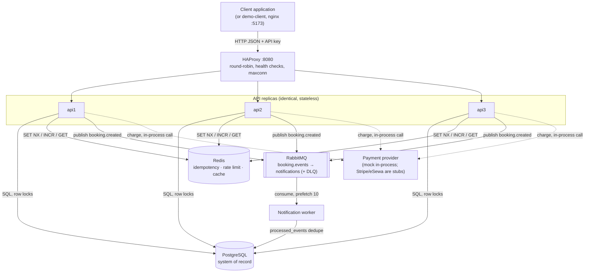

# Architecture overview

SlotBook is a **modular monolith** deployed as several processes: three identical
HTTP API replicas behind HAProxy, one notification worker, and shared PostgreSQL,
Redis and RabbitMQ instances. There is one codebase (`backend/`) with two entry points
(`src/main.ts`, `src/worker.ts`) and an optional React reference client (`demo-client/`).
Applications integrate over HTTP with an API key; see [../api/overview.md](../api/overview.md).

This page describes what exists in the repository today. Problems with the current
design are collected in [known-limitations.md](known-limitations.md).

## Components



| Component | Code / config | Responsibility | Why it exists |
|---|---|---|---|
| Demo client | `demo-client/` | Browse services, pick a slot, submit a booking, "Ops" page for failure toggles | Reference client only; the backend does not depend on it. |
| HAProxy | `docker/haproxy/haproxy.cfg` | Round-robin across `api1..3`, `GET /api/health` every 2s, `maxconn 200` (frontend) / `50` (per server), adds `X-Forwarded-For` | Makes the API genuinely multi-instance so that any in-process state becomes a visible bug. |
| API process | `src/main.ts`, `src/composition/buildApp.ts` | HTTP, API-key auth, validation, booking orchestration (create, cancel), catalog reads | Stateless request handling; horizontal scale by adding replicas. |
| Worker process | `src/worker.ts` | Consumes `booking.created`, "sends" a confirmation (logs it), dedupes via Postgres | Keeps slow/unreliable side effects out of the request path. |
| PostgreSQL | `src/infrastructure/database/`, `migrations/001_init.sql` | Services, time slots, bookings, processed events | Source of truth. Row locks and unique indexes enforce booking invariants. |
| Redis | `src/infrastructure/redis/redis.ts`, `src/infrastructure/cache/` | Idempotency records, fixed-window rate-limit counters, catalog cache | State that must be shared between replicas but is not the system of record. |
| RabbitMQ | `src/infrastructure/messaging/rabbitmq.ts` | Topic exchange `booking.events`, queue `notifications`, DLQ `notifications.dlq` | Durable hand-off from the API to the worker. |
| Payment provider | `src/infrastructure/external-services/PaymentProviders.ts` | `charge()` behind a `PaymentProvider` port | Only `MockPaymentProvider` does anything; `stripe` and `esewa` return success without calling anything. |

There is no WebSocket/Socket.IO layer, no user accounts (auth is per client application,
via API key), no provider/staff model, no scheduler/cron process and no outbound email
integration in this repository.

## Layering inside `backend/src`

```text
interfaces/      HTTP controllers, middleware, routes; AMQP consumer
application/     Use cases (CreateBooking, queries), CatalogCache facade
domain/          Entities (Booking, TimeSlot), ports (repositories, PaymentProvider, EventPublisher)
infrastructure/  Postgres, Redis, RabbitMQ, payment adapters, retry/timeout/circuit breaker, failure simulator
composition/     buildApp.ts — manual dependency wiring
shared/          errors, logger, graceful shutdown
```

Dependencies point inward: use cases depend on port interfaces, and
`composition/buildApp.ts` picks the concrete adapters. One exception worth knowing:
`CreateBookingUseCase` imports `withRetry`/`withTimeout` and the `CircuitBreaker` type
directly from `infrastructure/resilience`. See [ADR 0001](decisions/0001-modular-monolith-with-manual-di.md).

## Where state lives

| State | Location | Durability | Shared across replicas? |
|---|---|---|---|
| Services, slots, bookings | PostgreSQL | Durable (named volume `pgdata`) | Yes |
| Consumer dedupe (`processed_events`) | PostgreSQL | Durable | Yes |
| Idempotency records | Redis `idem:*` | Ephemeral (TTL 24h, no persistence configured) | Yes |
| Rate-limit counters | Redis `rl:*` | Ephemeral (TTL = window) | Yes |
| Catalog cache | Redis `cache:*` | Ephemeral (TTL 8–120s) | Yes |
| Booking events in flight | RabbitMQ durable queue, persistent messages | Survives broker restart | Yes |
| Circuit breaker state | Process memory | Lost on restart | **No** — each replica has its own |
| Failure-injection flags | Process memory | Lost on restart | **No** — `POST /api/admin/failures` only affects the replica that served it |
| Cache hit/miss counters | Process memory | Lost on restart | No (reported per replica in `/api/health`) |

The per-replica rows matter: flipping `failPayment` via the admin API through HAProxy
changes exactly one of the three replicas. Repeat the call (or hit each replica) if you
want the whole fleet to fail.

## Synchronous vs asynchronous work

Synchronous, inside `POST /api/bookings`:

1. API-key check (in memory) and rate-limit check (Redis)
2. Idempotency `begin` (Redis)
3. Service and slot lookup (Postgres)
4. Slot claim transaction (Postgres, `SELECT … FOR UPDATE`)
5. Slot cache invalidation (Redis)
6. Insert booking as `pending_payment` (Postgres)
7. Payment charge with timeout, retry, circuit breaker (in-process adapter)
8. Update booking to `confirmed` (Postgres)
9. Publish `booking.created` (RabbitMQ)
10. Idempotency `complete` (Redis)

Asynchronous:

- Confirmation "email" in the worker, after the API has already responded.

Everything the customer needs to know (was I booked? was I charged?) is decided
synchronously. Only the notification is deferred. Step-by-step detail and failure
branches are in [request-flow.md](request-flow.md).

## How components communicate

| From → To | Protocol | Notes |
|---|---|---|
| Client → HAProxy | HTTP/1.1 JSON, `Authorization: Bearer <api key>` | CORS origins from `CORS_ORIGINS` (default `*`). |
| HAProxy → API | HTTP/1.1 | `option http-server-close`, `option forwardfor`; the API sets `trust proxy` from `TRUST_PROXY` (`1` in Compose) so `req.ip` is the client. |
| API → Postgres | `pg.Pool`, max `DB_POOL_MAX` (10) per replica | 3 replicas × 10 + worker 5 = up to 35 connections. |
| API → Redis | `ioredis`, single connection per process | `maxRetriesPerRequest: 2`, reconnect backoff 100ms → 5s. |
| API → RabbitMQ | AMQP 0-9-1, one channel | Plain channel (no publisher confirms). Connection loss → graceful shutdown → restart. |
| Worker → RabbitMQ | AMQP 0-9-1, one channel, `prefetch(10)` | Manual ack. |
| Worker → Postgres | `pg.Pool` (`DB_POOL_MAX`=5 in Compose) | Only writes `processed_events`. |
| API → payment | In-process function call | The adapter boundary is where an HTTP client would go. |

Correlation: every request gets `x-request-id` and `x-correlation-id` (taken from the
request headers if present, otherwise generated). The correlation ID is copied into the
`booking.created` event and its AMQP headers, so API and worker logs can be joined.

## What happens when a component fails

Short version — details in [../distributed-systems/failure-scenarios.md](../distributed-systems/failure-scenarios.md).

| Component down | Effect |
|---|---|
| One API replica | HAProxy marks it down after 3 failed checks (~6s). Requests in flight on that replica fail. |
| All API replicas' health checks fail | HAProxy has no backend → clients get 503 from HAProxy. |
| PostgreSQL | Every booking and catalog-miss request fails (500 for real connection errors). Health returns 503 → HAProxy drains all replicas. |
| Redis | Reads still work on each replica (rate limiter and cache fail open for GET); bookings are refused (idempotency fails closed); `/api/health` returns 503, so HAProxy stops routing to every replica until Redis is back. Verified: recovery ~10s after Redis returns. |
| RabbitMQ at startup | API and worker exit with code 1; `restart: unless-stopped` retries them. |
| RabbitMQ at runtime | On connection/channel close, API and worker run graceful shutdown and are restarted by Compose, reconnecting on start. Verified with a broker restart: bookings succeed again afterwards. In-flight bookings at that moment are confirmed but their event publish fails. |
| Worker | Messages accumulate in `notifications`; nothing is lost. Unacked messages are redelivered when a consumer returns. |
| Payment provider (slow) | Each attempt is capped at `PAYMENT_TIMEOUT_MS`; up to `PAYMENT_MAX_RETRIES` attempts; circuit opens after 5 consecutive failed calls per replica. |

## Deployment topology (Docker Compose)

```text
postgres ─┬─ migrate ── seed ─┬─ api1 ─┐
redis ────┤                   ├─ api2 ─┼─ haproxy :8080 ── web :5173
rabbitmq ─┘                   ├─ api3 ─┘
                              └─ worker
```

`migrate` and `seed` are one-shot containers. `seed` only inserts demo data into an empty
database; wiping requires an explicit `--reset` (see [../deployment/self-hosting.md](../deployment/self-hosting.md)).
