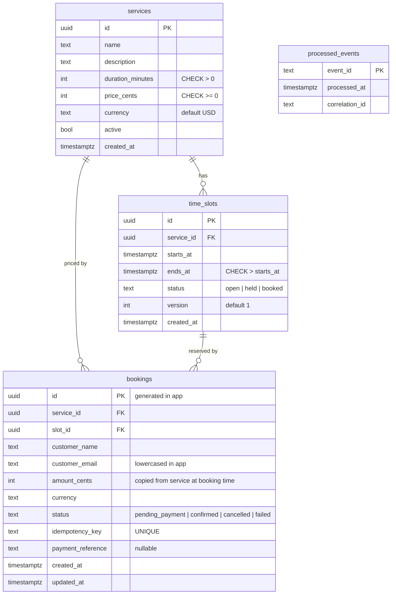

# Database schema

Single migration: `backend/src/infrastructure/database/migrations/001_init.sql`.
PostgreSQL 16 (Compose image `postgres:16-alpine`). Requires the `pgcrypto` extension
for `gen_random_uuid()`.



`processed_events` has no foreign key; its `event_id` is `booking.created:{bookingId}:email`.

## Indexes and what they enforce

| Index | Definition | Purpose |
|---|---|---|
| `time_slots_service_starts_uq` | `UNIQUE (service_id, starts_at)` | No duplicate slots for a service. Seed uses `ON CONFLICT DO NOTHING` against it. Does **not** prevent overlapping slots with different start times. |
| `time_slots_open_lookup_idx` | `(service_id, starts_at) WHERE status = 'open'` | Partial index for `listOpenSlots`. |
| `bookings_idempotency_uq` | `UNIQUE (idempotency_key)` | Durable backstop for idempotency. |
| `bookings_confirmed_slot_uq` | `UNIQUE (slot_id) WHERE status = 'confirmed'` | At most one confirmed booking per slot. Allows any number of `failed` bookings for the same slot (retries after declines). |
| `bookings_email_idx` | `(customer_email)` | `GET /api/bookings?email=`. |

## Design notes

- **Money as integer cents** (`amount_cents INT`, `price_cents INT`). No floating point.
  `INT` caps a single amount at ~21 million units of currency.
- **Price is copied onto the booking**, so a later price change doesn't alter what was
  charged. The client never sends a price.
- **`version` on `time_slots`** supports the optimistic check in `claimSlot`
  (see [../distributed-systems/database-locking.md](../distributed-systems/database-locking.md)).
- **Booking IDs are generated in the application** (`randomUUID()`) rather than by the
  database, so the ID exists before the insert and can be passed to the payment provider.
- **Status columns are `TEXT` + `CHECK`**, not Postgres enums, which makes adding a state a
  simple constraint change.
- **Timestamps** on bookings are set by the application (`created_at`, `updated_at`), not
  by DB defaults or triggers.
- **No `ON DELETE` behavior** is defined; deleting a service with slots or bookings fails.
  The seed script deletes bookings → slots → services in that order.

## Migrations

`npm run migrate` executes `001_init.sql` as one multi-statement query. Every statement is
`CREATE … IF NOT EXISTS`, so re-running is safe. There is no migration table, no
versioning and no down-migration; adding `002_*.sql` would require changing
`migrate.ts`, which hard-codes the file name.

## Seed data

`npm run seed` (`seed.ts`):

1. If any service exists, prints "skipping seed" and exits. It never touches existing data.
2. Otherwise inserts three services (Classic Haircut, Deep Tissue Massage, Strategy
   Consultation), and for each, slots at 10:00, 12:00, 14:00, 16:00 **UTC** for today and
   the next 6 days.

`npm run seed:reset` (`seed.ts --reset`) first **deletes all rows** from `processed_events`,
`bookings`, `time_slots` and `services`, then seeds. Every seed generates new UUIDs, so
flush the catalog cache afterwards. The Compose `seed` service runs the non-destructive
form on every `docker compose up`.

## Resetting a local database

```bash
cd backend && npm run seed:reset                        # keep schema, replace all data
docker compose down -v && docker compose up --build     # drop the volume entirely
```
