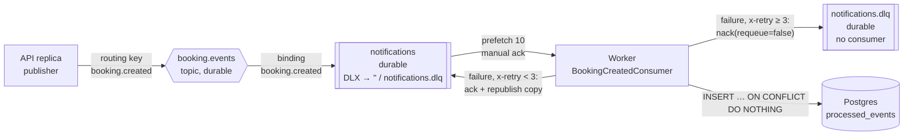

# Queues and background jobs

The only background work is the confirmation notification for a new booking. It runs in
a separate process (`backend/src/worker.ts`) fed by RabbitMQ. There are no scheduled
jobs, cron tasks, reapers or outbox relays.

## Problem

Sending an email inside `POST /api/bookings` would put an unreliable third party on the
critical path: a slow SMTP server makes bookings slow, and an email outage would fail
bookings that were already paid for. The notification is a consequence of a booking,
not part of it.

## Topology

Declared at startup by both the API and the worker (`setupTopology` in
`infrastructure/messaging/rabbitmq.ts`):



| Element | Name (env var) | Properties |
|---|---|---|
| Exchange | `booking.events` (`BOOKING_EVENTS_EXCHANGE`) | `topic`, durable |
| Queue | `notifications` (`NOTIFICATION_QUEUE`) | durable; `x-dead-letter-exchange: ''`, `x-dead-letter-routing-key: notifications.dlq` |
| Dead-letter queue | `notifications.dlq` (`NOTIFICATION_DLQ`) | durable; nothing consumes it |
| Binding | `booking.created` | |
| Prefetch | 10 | per channel |

## Producer

`CreateBookingUseCase`, after the booking is `confirmed`:

```ts
channel.publish('booking.events', 'booking.created', Buffer.from(JSON.stringify(event)), {
  contentType: 'application/json',
  deliveryMode: 2,                                   // persistent
  messageId: `booking.created:${bookingId}`,
  headers: { correlationId },
});
if (!ok) await once(channel, 'drain');
```

The message carries the customer's name and email (the worker needs them), amount,
service/slot IDs and the correlation ID.

What the producer does **not** do:

- **No publisher confirms.** A plain channel is used, so `publish()` returning means the
  message was written to the socket buffer, not that the broker stored it. A broker
  crash right after `publish()` can lose the message with no error seen by the API.
- **No outbox.** The publish happens after the `UPDATE … confirmed` has committed and is
  not in the same transaction. If the process dies between the two, or the publish throws,
  the booking is confirmed and the event is never sent. Nothing re-sends it later.

## Consumer

`bindBookingCreatedConsumer` in `interfaces/consumers/BookingCreatedConsumer.ts`.

### Message lifecycle

```text
ready in queue
  → delivered (unacked, counts against prefetch)
  → JSON.parse → handle()
       ├─ type ≠ booking.created → ack (dropped, logged as warning)
       ├─ duplicate (processed_events hit) → ack
       ├─ success → ack
       └─ throw
            ├─ x-retry < 3 → ack original, sendToQueue(copy, x-retry+1)   → back of the queue
            └─ x-retry ≥ 3 → nack(requeue=false) → dead-lettered to notifications.dlq
```

### Retries

- Up to 3 republishes → 4 attempts total.
- **Immediate**, no delay or backoff. If the failure is a Postgres outage, all four
  attempts happen within milliseconds of each other (subject only to queue depth), and the
  message lands in the DLQ before Postgres is likely to recover.
- The retry copy goes straight to the queue via the default exchange, not back through
  `booking.events`.
- **Ack-then-republish is not atomic.** If the worker dies after `ack` and before
  `sendToQueue` reaches the broker, the message is gone. Using `nack` + a delayed retry
  queue (TTL + DLX) would avoid both this and the missing backoff.

### Acknowledgement

Manual. `ack` only after `handle()` resolves. A message is never acked before its
side effect runs, except on the retry path described above.

### Dead-letter behavior

After 4 failed attempts the message is rejected without requeue and RabbitMQ routes it to
`notifications.dlq`. There is no consumer, alerting, or replay tool for the DLQ — messages
stay there until someone moves them manually (e.g. with the management UI at
`http://localhost:15673`, "Move messages" / shovel).

### Duplicate processing

Expected and handled: see [idempotency.md](idempotency.md#2-notification-consumer). The
dedupe key is `booking.created:{bookingId}:email` in `processed_events`.

### Worker crash

- Unacked messages (up to 10, the prefetch) return to `ready` when the connection drops
  and are redelivered to the next consumer.
- The `processed_events` insert makes redelivery safe for bookkeeping; see the
  mark-then-send caveat in [idempotency.md](idempotency.md#failure-scenarios).
- Compose restarts it (`restart: unless-stopped`). Messages accumulate in
  `notifications` meanwhile; they are persistent and the queue is durable, so a broker
  restart does not lose them.

### Backpressure

- **Consumer side:** `prefetch(10)` bounds how many unacked messages one worker holds.
- **Producer side:** the `drain` wait handles a full socket buffer. If the channel closes
  while waiting, the `drain` promise never resolves and that request hangs until
  HAProxy's 50s server timeout.
- **Queue side:** no `x-max-length` or TTL, so the queue grows without bound if the
  worker is down.

### Scaling

The worker is stateless and competes for messages on one queue, so running more workers
(`docker compose up --scale worker=3`) increases throughput. Ordering between
notifications is not preserved across workers, which does not matter for independent
emails.

## Connection handling

- `amqp.connect()` at startup: failure rejects → `main()` exits with code 1 for both API
  and worker. Compose's `restart: unless-stopped` retries.
- `error` listeners on the connection and channel log the error.
- A `close` of the connection or channel that isn't part of our own shutdown calls
  `onConnectionLost`. API and worker respond by sending themselves `SIGTERM`, which runs
  the normal graceful shutdown, and the supervisor restarts them with a fresh connection.
  There is no in-process reconnect: a restarted process re-runs `setupTopology` and
  re-registers the consumer, which is simpler and harder to get wrong than rebuilding
  channels in place.
- Verified (2026-09-28) by restarting RabbitMQ under a running stack. Before this change,
  the API processes stayed up with a closed channel: bookings were **confirmed and charged
  but returned 500 and published nothing**, indefinitely. After it, the APIs logged
  `RabbitMQ channel closed`, shut down, restarted, and the next booking returned 201.
- Cost: a broker restart briefly takes down every API replica at once. Requests in flight
  at that moment that already confirmed get a 500, with no event.
- No heartbeat interval is configured explicitly (amqplib/RabbitMQ defaults apply).

## Trade-offs

- **Decoupling vs. guarantees.** The booking response does not depend on email, which is
  the goal. The price is that "every confirmed booking gets exactly one email" is not
  guaranteed: the event can be lost at publish (no confirms, no outbox) and the email can
  be lost at consume (mark-then-send).
- **RabbitMQ vs. a Postgres job table.** A job table written in the same transaction as
  the confirm would remove the dual write entirely and needs no extra infrastructure. The
  broker gives push delivery, DLQ routing and a management UI out of the box. The
  repository chose the broker; see [ADR 0005](../architecture/decisions/0005-rabbitmq-for-async-notifications.md).
