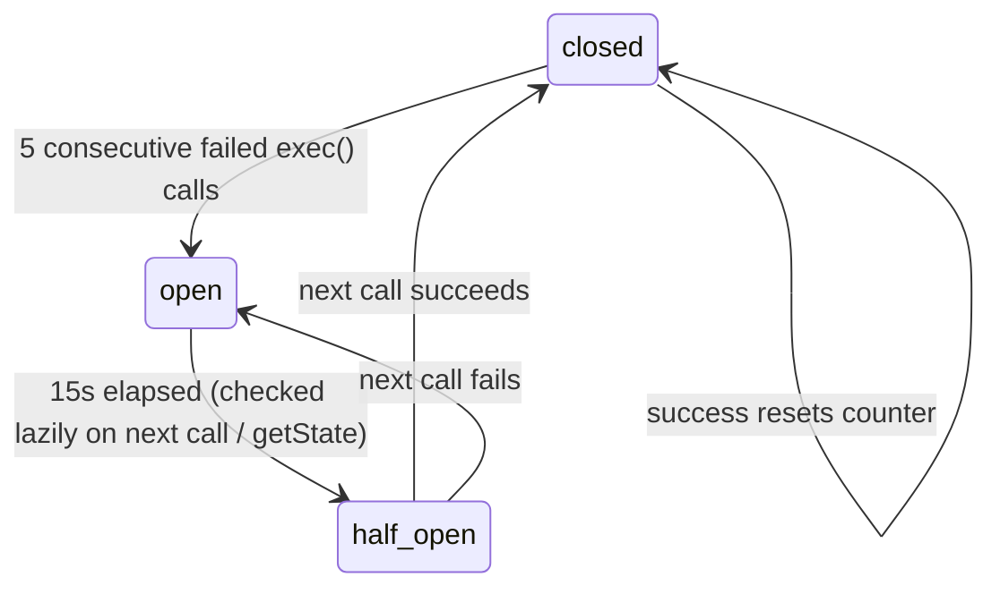

# Retries, timeouts and the circuit breaker

## Problem

The payment provider is a remote dependency. It can be slow, fail transiently, or be
down for minutes. Without limits:

- a slow provider holds every booking request open until HAProxy's 50s timeout;
- naive immediate retries from three replicas multiply load on a provider that is
  already struggling;
- every booking keeps paying the full timeout cost even when the provider is clearly down.

## Naive implementation

```ts
while (true) {
  try { return await payments.charge(input); }
  catch { /* try again */ }
}
```

No deadline, no cap, no spacing, no memory of recent failures.

## Actual implementation

`CreateBookingUseCase` composes three wrappers from `infrastructure/resilience/`:

```ts
paymentCircuit.exec(() =>
  withRetry(
    () => withTimeout(payments.charge(input), PAYMENT_TIMEOUT_MS, 'Payment provider timed out'),
    {
      maxAttempts: PAYMENT_MAX_RETRIES,        // 3 → 3 attempts total, not 3 retries
      baseDelayMs: 100,
      maxDelayMs: 2000,
      isRetryable: (err) => err instanceof Error && err.message.includes('timed out'),
    },
  ),
);
```

```text
circuit breaker  (per replica, counts one failure per whole retry sequence)
  └─ retry       (up to 3 attempts, exponential backoff + jitter, timeouts only)
       └─ timeout (3s per attempt)
            └─ charge()
```

### `withTimeout`

`Promise.race` between the call and a timer. The timer is cleared on settle.

It does **not** cancel the underlying operation — the losing `charge()` promise keeps
running. With a real HTTP client, the request continues and may succeed at the provider
after the caller has given up. That is why the provider-side idempotency key matters
(and why the current adapters, which ignore it, would double-charge; see
[idempotency.md](idempotency.md#payment-provider-idempotency)).

### `withRetry`

Delay before attempt *n+1*: `min(maxDelayMs, baseDelayMs × 2^(n−1))` plus jitter of up
to `min(100, 20% of that)` ms.

With the defaults:

| Attempt | Timeout | Delay before next |
|---|---|---|
| 1 | 3000ms | 100–119ms |
| 2 | 3000ms | 200–239ms |
| 3 | 3000ms | — (throws) |

Worst-case payment latency ≈ **9.36s** per booking request.

Only errors whose message contains `timed out` are retried. Declines are returned as
`{ success: false }` values (not thrown) and are never retried, even when the provider
marks them `retryable: true` — the use case turns them into `402 PAYMENT_FAILED` with
`retryable` set from the provider's flag, leaving the decision to the client.

### `CircuitBreaker`

In-memory, per replica. `payment` breaker: `failureThreshold: 5`, `resetTimeoutMs: 15000`.



Details that follow from the code:

- A "failure" is one `exec()` that **throws** — i.e. a full retry sequence that ended in
  timeouts. Five failures can therefore take up to 5 × 9.36s ≈ 47s of wall time to
  accumulate.
- **Declined payments count as success** for the breaker, because `charge()` resolves.
  A decline also resets the consecutive-failure counter.
- `half_open` does not limit concurrency: every request that arrives while half-open is
  let through, not just one probe.
- The state is visible per replica in `GET /api/health` → `circuitBreaker`.
- When open, `exec()` throws a plain `Error('Circuit open for payment')` → the booking is
  marked `failed`, the slot released, and the client receives **500** `INTERNAL_ERROR`.
  There is no `Retry-After` or specific error code.

## Other timeouts and retry policies in the system

| Where | Setting | Value | Source |
|---|---|---|---|
| Postgres pool | `connectionTimeoutMillis` | 5000ms | `database/pool.ts` |
| Postgres pool | `idleTimeoutMillis` | 30000ms | `database/pool.ts` |
| Postgres | statement / lock timeout | **not set** | — |
| Redis | reconnect backoff | 100, 250, 500, 1000, 2000, then 5000ms forever | `redis/redis.ts` |
| Redis | `maxRetriesPerRequest` | 2 | `redis/redis.ts` |
| Redis | command timeout | **not set** | — |
| RabbitMQ | connect retry at startup | none in-process; process exits and Compose restarts it | `messaging/rabbitmq.ts`, `docker-compose.yml` |
| RabbitMQ consumer | retries | 3 republishes, immediate | `BookingCreatedConsumer.ts` |
| HAProxy | `timeout connect` / `client` / `server` | 5s / 50s / 50s | `haproxy.cfg` |
| HAProxy | health check | every 2s, down after 3 fails, up after 2 passes, check timeout 2s | `haproxy.cfg` |
| Cache fill lock | TTL / waiter sleep | 3s / 40ms | `RedisCacheStore.ts` |
| Graceful shutdown (API / worker) | force-exit timer | 25s / 10s | `shared/shutdown.ts`, `worker.ts` |
| Compose stop | `stop_grace_period` (API replicas) | 30s | `docker-compose.yml` |
| Node HTTP server | request / headers timeouts | Node defaults (not configured) | — |

There is no end-to-end request deadline. A booking request's total time is the sum of
Redis, Postgres and payment time, bounded only by HAProxy's 50s server timeout. When
HAProxy times out, the client sees 504 but the API keeps processing — and, because of
idempotency, a retry with the same key gets `409 in progress` (while it runs) or the
replay (after it completes).

## Failure scenarios

| Scenario | What happens |
|---|---|
| Provider slow once (one attempt > 3s) | Retried after ~100ms; succeeds if the next attempt is fast. |
| Provider consistently slow | 3 timeouts (~9.4s) → booking `failed`, slot released → 500. Five of these on one replica open its breaker. |
| Provider down (fast failures) | Depends on how the adapter reports it. The mock returns declines → 402 each time; the breaker never opens. |
| Provider recovers | Each replica's breaker half-opens independently 15s after it opened. |
| Two requests arrive simultaneously while breaker is half-open | Both call the provider. |
| Client retries after a 500 from payment timeout | Same key → 409 (record stuck `in_progress`). New key → new attempt. |
| Process crashes mid-retry | Booking remains `pending_payment`; slot stays `booked`; charge state unknown. No recovery. |
| `PAYMENT_LATENCY_MS` > `PAYMENT_TIMEOUT_MS` | Every attempt times out; useful for demonstrating the breaker. Note the mock still "completes" each late charge in the background (logged as `Payment charged`). |

## Trade-offs

- **Retry inside the request** keeps the client simple but multiplies worst-case latency
  by the attempt count. For payments, many systems prefer a single attempt with a
  provider idempotency key and let the client retry.
- **Timeout-only retry** is conservative and correct for ambiguous failures, provided the
  charge is idempotent at the provider. Without that, retrying a timeout is the most
  dangerous retry there is.
- **Per-replica breaker** needs no coordination, but each replica must learn about an
  outage independently (3 × 5 failures), and the health endpoint shows a different state
  depending on which replica answered.
- **Declines resetting the breaker** means a provider that fails fast with errors
  expressed as declines will never trip it.
